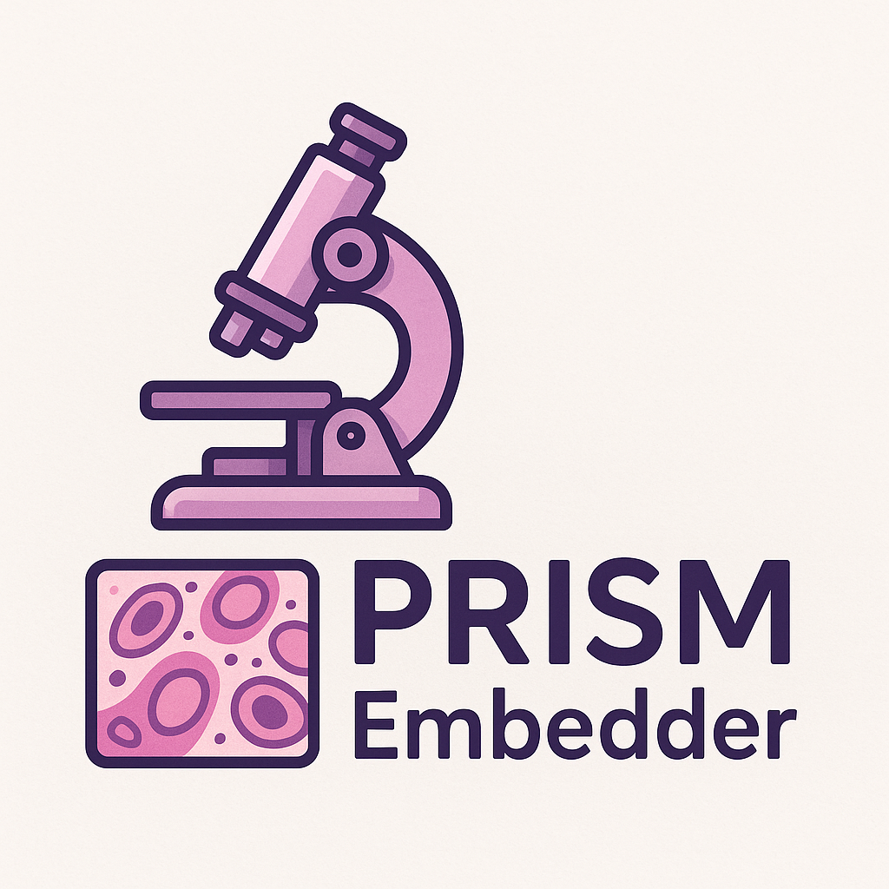

<h1 align="center">PRISM Embedder</h1>

<p align="center">
  
</p>

<p align="center">
  <a href="https://pypi.org/project/prism-embedder/">
    
  </a>
  <a href="https://hub.docker.com/r/waticlems/prism_embedder">
    
  </a>
</p>

<p align="center">
  Extract slide-level embeddings from whole-slide images using PRISM.
</p>

---

## 🚀 Overview

**PRISM Embedder** is a containerized algorithm for computing slide-level representations from whole-slide images using [PRISM](https://huggingface.co/paige-ai/Prism).

> ⚠️ **Access Required**  
> This algorithm depends on the gated models **PRISM** and **Virchow**.  
> Execution is only permitted for users who have been **explicitly verified** by the algorithm editor to have **requested and been granted** access to both.


## 🛠️ Installation & Usage

**Requirements:**  
- Linux-based OS (e.g., Ubuntu 22.04)  
- Python 3.10+  
- Docker installed

**Run with Docker:**

> Replace `</path/to/your/slide.tif>` and `</path/to/your/mask.tif>` with your actual file paths.  
> Replace `</path/to/your/output/folder>` with the path to a folder where you have **write access**.

```bash
docker pull waticlems/prism_embedder:latest
docker run --rm -it \
    -v </path/to/your/slide.tif>:/input/images/whole-slide-image/slide.tif:ro \
    -v </path/to/your/mask.tif>:/input/images/tissue-mask/mask.tif:ro \
    -v </path/to/your/output/folder>:/output \
    waticlems/prism_embedder:latest
```

Upon execution, the following files will be saved in `/output`:

- `image-neural-representation.json`: 1280-dimensional slide-level embedding (JSON)
- `whole-slide-tiling-thumbnail.png`: PNG image showing the tissue tiling layout

## 📌 TODO

- [ ] add tSNE plot
- [ ] improve CLI customization (e.g., for spacing, resolution)